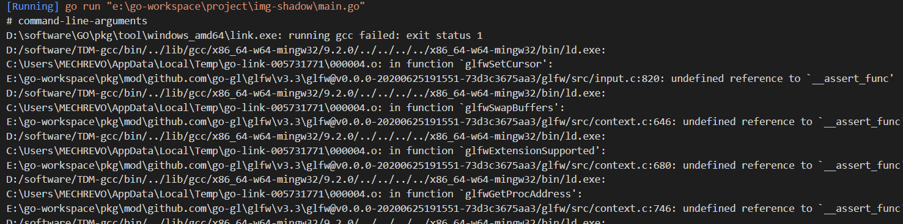

[TOC]
# fyne
一个go-gui框架，跨平台，目前star最多
## gcc编译器
**GCC**（GNU Compiler Collection，GNU编译器套装 

在windows下运行GCC需要安装gcc环境  
MSYS2 和Cygwin是模拟环境，让程序察觉不出来自己在windows环境下 
minGW是直接转换代码，编译出windows下的目标码  
TDM-GCC windows上的编译套件  
官网推荐了三个  
>MSYS2 with MingW-w64 - msys2.org  
>TDM-GCC - tdm-gcc.tdragon.net  
>Cygwin - cygwin.com  
  
### 问题
我试过Cygwin和TDM-GCC,最新版的Cygwin编译失败报下面这个错，推测是gcc版本不兼容
```sh
/usr/bin/ld: cannot find -lmingwex
/usr/bin/ld: cannot find -lmingw32
```
无奈之下换了TDM-GCC,然后报错如下：

最后将`C:\Users\MECHREVO\AppData\Local\go-build`目录删除后重新编译，终于通了


matlab中fftshift规则是这样的：
假如输入矩阵为：
              1     2     3     4     5
              6     7     8     9    10
              11    12    13    14    15
经过fftshift之后变成：
              14    15    11    12    13
               4     5     1     2     3
               9    10     6     7     8
步骤：1、先获取输入数组的长和宽： M ,N
      2、对宽和高除以2取整，即：M1 = floor(M/2),N1=floor(N/2);
      3,对每一个位置的值移动M1行，N1列;
      eg:比如输入数组中第一个元素1，M1 = 1，N1 = 2;即移动1行2列，从输出数组很容易看出1所在的新位置，
      4、对于溢出的元素，比如输入数组中的第5个元素“5”自动循环到矩阵开始位置并移动1行2列；